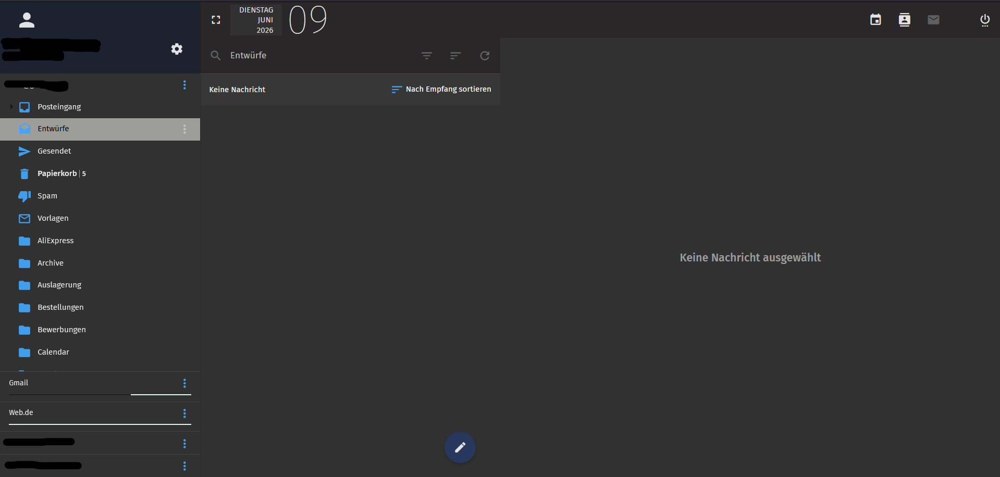
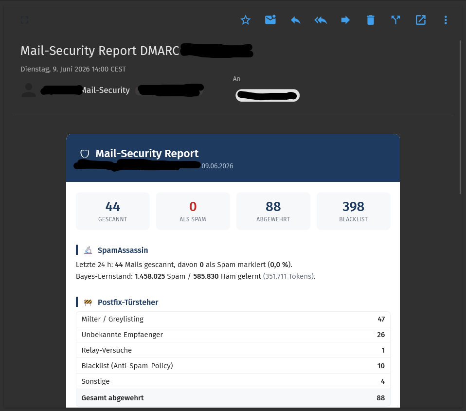
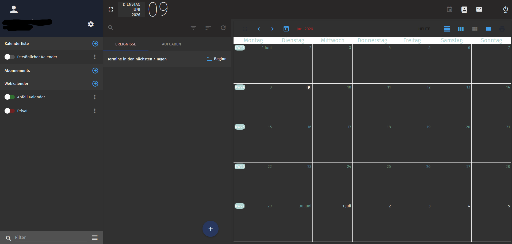

# SoGO-Dark-Theme-blue

Need you some dark grey theme with blue icons? Use this one.

Ein dunkelgraues SOGo-Theme mit blauen Icons – entstanden in vielen Nachtschichten. 🌙



## Installation

Login to Terminal

Backup the original file first:

```
cp /usr/lib/GNUstep/SOGo/WebServerResources/css/theme-default.css /usr/lib/GNUstep/SOGo/WebServerResources/css/theme-default.css.bak
```

Replace the file in:

```
/usr/lib/GNUstep/SOGo/WebServerResources/css/theme-default.css
```

After saving the file, restart SOGo:

```
systemctl restart sogo
```

Then reload your browser with **Ctrl+F5** to clear the cached CSS.

## Features

- Dark grey interface (mail, calendar, preferences, dialogs)
- Blue icons and accents
- Dark mail reading pane with dark outer frame around HTML mails
- Sender e-mail address styled as a chip for better readability
- Dark recipient block and chips

## Screenshots






## Notes

- The theme is a full replacement of `theme-default.css`
- Tested with SOGo 5.x
- An update of the SOGo package may overwrite the file – keep a copy of this CSS so you can restore it after updates

---

Made with patience, Ctrl+F5 and a lot of night sessions. ☕
